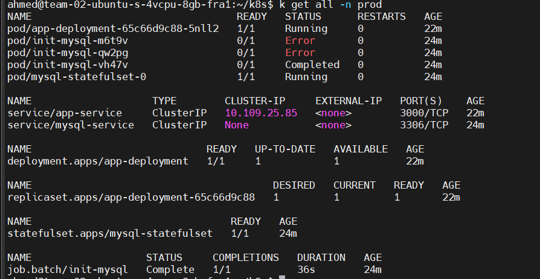
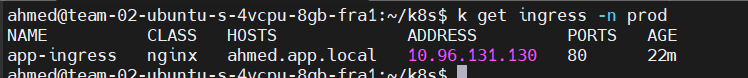
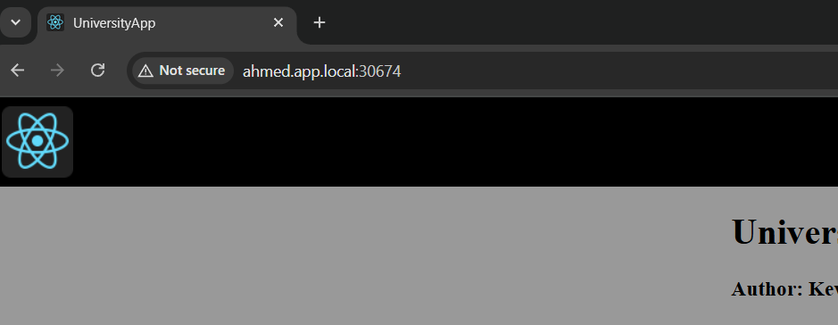
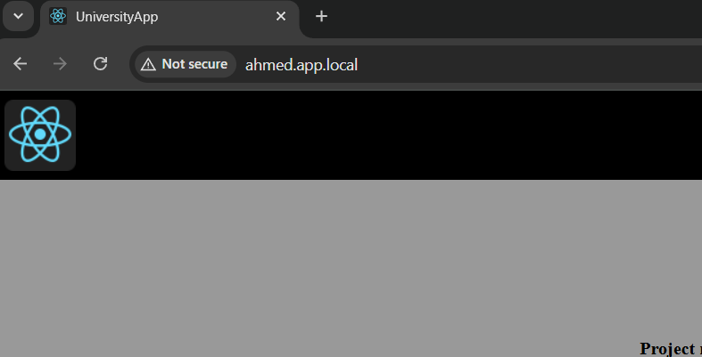
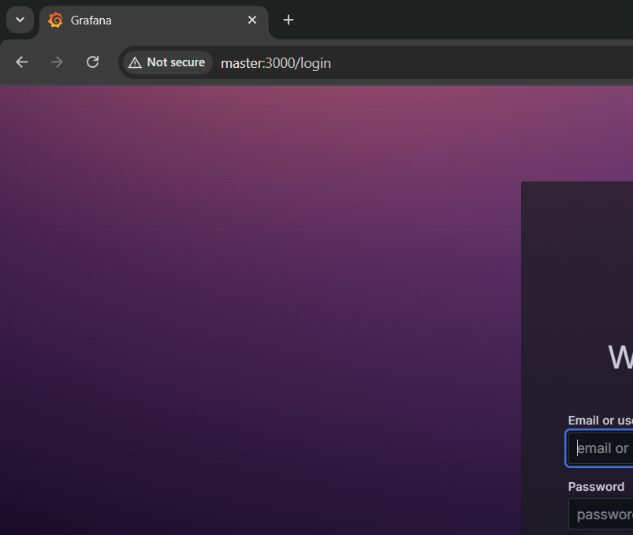
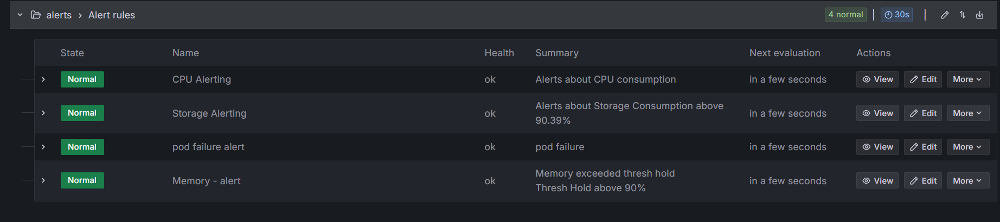
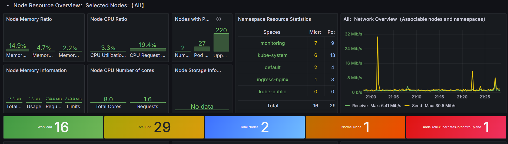
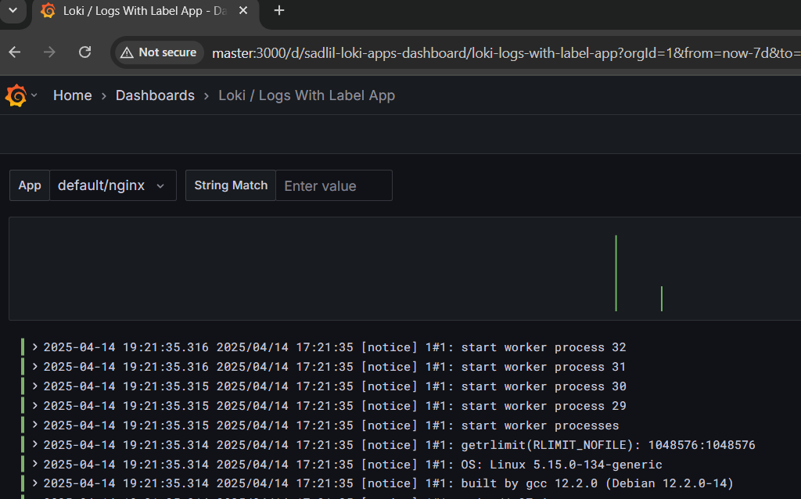

# Application Guide

This guide explains how to test the application overall and demonstrate its setup and everything about it.

---
## The project content

- Installing two-node Kubernetes cluster using the kubeadm way version *1.31.7* and configured containerd as a container runtime.
- Automating infrastruce configuration with Ansible Roles.
- Writing a Docker file and k8s manifests files needed for the project.
- Complete CI/CD pipeline for building, testing and deploying the application in two environment.
- Using Nginx as a Reverse proxy and configured it to forward the traffic to the application.
- Using Prometheus and Grafana for monitoring and logging the application.


## 📦 Prerequisites

Make sure you have the following installed on your machine:

- [Docker](https://docs.docker.com/get-docker/)
- [Git](https://git-scm.com/)
- [Node.js-16](https://nodejs.org/) 

---

## 🧪 Running the Application Locally

1. **Clone the Repository**
   ```bash
   git clone https://github.com/Ahmedmelenany/End-To-End-React-NodeJS-Project.git
   ```

2. **Install Dependencies**

   ```bash
   npm install --no-audit
   ```


3. **Build the Application**

   ```bash
   Add you database credentials at path: src/server/db/protected/dbcon-dev.ts
   npm run build-all
   ```


3. **test the simple test case**
   
   ```bash
   npm test
   ```

4. **run and Test it**
   Open your browser after start:
   ```
   npm start
   http://localhost:3000
   ```
---

## 🐳 Building the Docker Image

1. **Build the Docker Image**
   ```bash
   docker build -t your-app-name .
   ```

2. **Run the Docker Container**
   ```bash
   note pass environments of your db
   docker run -p 3000:3000 your-app-name -e ..
   ```

3. **Test the App in Docker**
   Go to:
   ```
   http://localhost:3000
   ```

---

## 🚰 Notes

- create a `.env` file and add them there for the test case.
- Make sure your `Dockerfile` is in the root directory of the project.
- You can use `docker-compose` if your app depends on other services like databases.

---

# 🪖 Ansible

You can use Ansible to automate your infrastructure configuration. 

1. **Go to the right directory**

   ```bash
   cd Ansible-roles
   ```
2. **Add the IPs of your machines and Execute the playbook**

   ```bash
   ansible-playbook -i inventory playbook.yaml
   ```


# 📅 Jenkins CI/CD Pipeline

To set up a Jenkins pipeline for this project:

1. **Install Jenkins** on your machine or server.

2. **Install the recommended and following plugins**:
   - Blue Ocean
   - Job Cacher
   - NodeJS
   - HTML Publisher
   - Docker
   - Kubernetes

3. **Configure system and tools in manage jenkins section and configure the pipeline and use the Jenkinsfile provided**

4. **Make sure that the integration with the tools is ready (docker, kubernetes, ...) and run the pipeline**

5. **Screenshots of the pipeline, Artifacts and slack message**

   ***Pipeline view***


   ***Artifacts***


   ***Slack message***


# Kubernetes 

1. **Go to kubernetes folder**

- Every Environment has its persistance volume.
- For staging Env you should configured service of the app as nodeport.
- For prod Env has an ingress and network policy.

```bash
   cd kubernetes
   ./install.sh < staging or prod >
   ```


2. **Ingress and Nginx**

- Ingress is used to expose the app to the outside world.
- Using Nginx container as a reverse proxy to route traffic to the app.
- Network policy is used to restrict traffic between pods.





- Running Nginx container 

```bash
   docker run --name nginx-reverse-proxy -p 80:80 --add-host=host.docker.internal:host-gateway \
   -v $(pwd)/default.conf:/etc/nginx/conf.d/default.conf nginx 
   ```
- You can forwarding to http://ip:port directly or using add-host option as above.
- Nginx as reverse proxy conf file 

```bash
   server {
    listen 80;
    server_name ahmed.app.local;

    location / {
        proxy_pass http://host.docker.internal:30674;
        proxy_set_header Host $host;
        proxy_set_header X-Real-IP $remote_addr;
               }
          }
   ```




# 📈 Monitoring with Prometheus and Grafana

A basic setup for monitoring and logging a Kubernetes cluster using Prometheus, Grafana, and Loki.

## 🧠 Overview
- **Monitoring**: Prometheus scrapes metrics from Kubernetes components and workloads. Grafana visualizes the data.
- **Logging**: Loki collects logs using promtail, which can also be viewed through Grafana.
- **Visualization**: Configured prom and loki as datasources to grafana and running at port 3000.




---

## 🔧 Prerequisites
- A running Kubernetes cluster (I'm using kubeadm cluster)
- `kubectl` configured
- Helm 3 installed

---

### 1. Add Helm Repos
```bash
kubectl create namespace monitoring
helm repo add prometheus-community https://prometheus-community.github.io/helm-charts
helm repo update
```

### 2. Install Prometheus Stack
```bash
helm show values prometheus-community/kube-prometheus-stack > prom-values.yml
# Open values file with any text editor and set grafana enabled as false (true by default)
# Or use this with helm install command --set grafana.enabled=false
 
helm install prometheus prometheus-community/kube-prometheus-stack \
  --namespace monitoring

# Adject svc of prometheus to be nodeport to access it or use kubectl port-forward 
```

### 3. Access Grafana Dashboard
Visit: `http://localhost:3000`  
Default credentials: `admin / admin`
Add Prometheus as a data source with its endpoint: `http://localhost:<port>`
---

## 📄 Logging with Loki and Promtail

### 1. Add Loki Helm Repo
```bash
helm repo add grafana https://grafana.github.io/helm-charts
helm repo update
```

### 2. Install Loki Stack
```bash
# By default grafana is disabled and promtail is enabled 
helm install loki grafana/loki-stack --namespace monitoring 
kubectl port-forward -n monitoring svc/loki 3100:3100 &

```

### 3. Add Loki as a Data Source in Grafana
- Go to Grafana → **Settings** → **Data Sources** → **Add data source** → Select **Loki**
- URL: `http://localhost:3100`

---
## 🚨 Alerting in Grafana

### 1. Enable and Manage Alerting in Grafana
- Navigate to **Alerting** → **Alert Rules** to create and manage alerts.
- Alerts can be configured to trigger on dashboards or data sources (Prometheus, Loki and any data source)

- Setup alerts for *CPU Alerting - Storage Alerting - Pod Failure - Memory Alert*

### 2. Setup Notification Channels
- Go to **Alerting** → **Contact points** to set up integrations (Slack, Email, webhooks).
- Use **Notification Policies** to manage alert routing and escalation.




## 🛠️ Custom Dashboards
- Import pre-built dashboards from Grafana.com and Custom its with the correct queries 

- Prometheus Dashboard


- Loki Dashborad (Logs with label app)

---
---

## 🧹 Cleanup
```bash
helm uninstall kube-prometheus-stack -n monitoring
helm uninstall loki -n monitoring
kubectl delete ns monitoring 
```

---

## 📚 References for monitoring 
- https://github.com/prometheus-community/helm-charts
- https://grafana.com/docs/
- https://grafana.com/grafana/dashboards/

