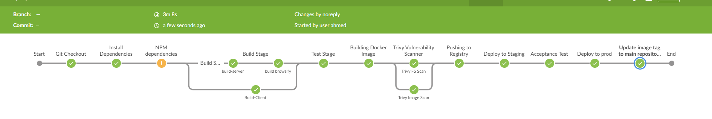
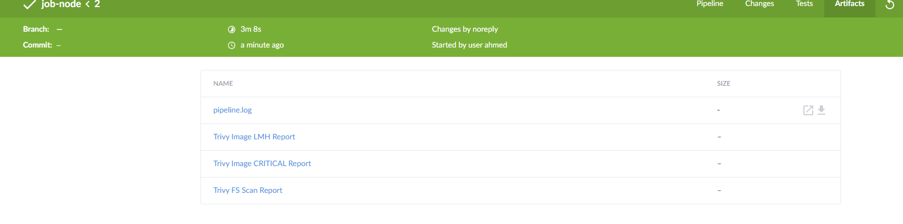
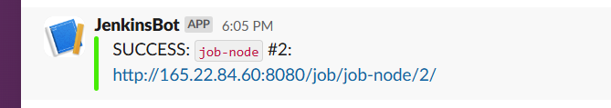

# Application Guide

This guide explains how to test the application locally and how to build a Docker image for it.

---

## 📦 Prerequisites

Make sure you have the following installed on your machine:

- [Docker](https://docs.docker.com/get-docker/)
- [Git](https://git-scm.com/)
- [Node.js-16](https://nodejs.org/) 

---

## 🧪 Running the Application Locally

1. **Clone the Repository**
   ```bash
   git clone https://github.com/Ahmedmelenany/End-To-End-React-NodeJS-Project.git
   ```

2. **Install Dependencies**

   ```bash
   npm install --no-audit
   ```


3. **Build the Application**

   ```bash
   Add you database credentials at path: src/server/db/protected/dbcon-dev.ts
   npm run build-all
   ```


3. **test the simple test case**
   
   ```bash
   npm test
   ```

4. **run and Test it**
   Open your browser after start:
   ```
   npm start
   http://localhost:3000
   ```
---

## 🐳 Building the Docker Image

1. **Build the Docker Image**
   ```bash
   docker build -t your-app-name .
   ```

2. **Run the Docker Container**
   ```bash
   note pass environments of your db
   docker run -p 3000:3000 your-app-name -e ..
   ```

3. **Test the App in Docker**
   Go to:
   ```
   http://localhost:3000
   ```

---

## 🚰 Notes

- create a `.env` file and add them there for the test case.
- Make sure your `Dockerfile` is in the root directory of the project.
- You can use `docker-compose` if your app depends on other services like databases.

---

# 🪖 Ansible

You can use Ansible to automate your infrastructure configuration. 

1. **Go to the right directory**

   ```bash
   docker build -t your-app-name .
   ```
2. **Add the IPs of your machines and Execute the playbook**

   ```bash
   ansible-playbook -i inventory playbook.yaml
   ```


# 📅 Jenkins CI/CD Pipeline

To set up a Jenkins pipeline for this project:

1. **Install Jenkins** on your machine or server.

2. **Install the recommended and following plugins**:
   - Blue Ocean
   - Job Cacher
   - NodeJS
   - HTML Publisher
   - Docker
   - Kubernetes

3. **Configure system and tools in manage jenkins section and configure the pipeline and use the Jenkinsfile provided**

4. **Make sure that the integration with the tools is ready (docker, kubernetes, ...) and run the pipeline**

5. **Screenshots of the pipeline, Artifacts and slack message**
1. ***Pipeline view***


2. ***Artifacts***


3. ***Slack message***


